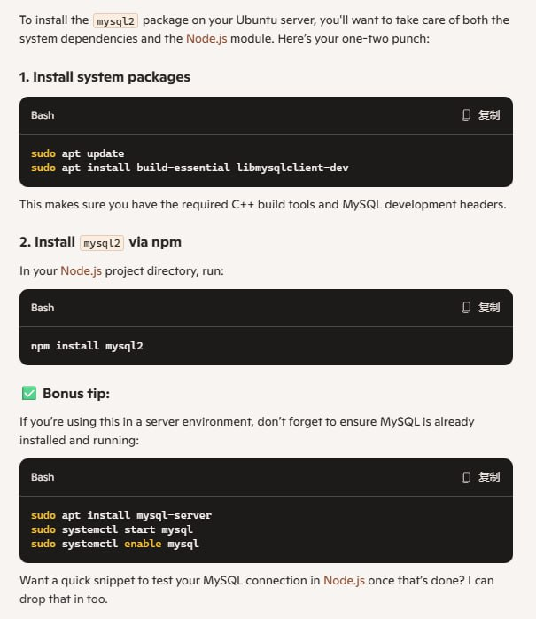

## Primary Setup

sudo apt install build-essential libmysqlclient-dev


------


## Language package

```
sudo apt update
sudo apt install language-pack-zh-hans language-pack-zh-hant
```

------

## How to run the GramJs

### In the root directory

```
sudo apt update
apt install npm
```

### Install Dependencies(root directory)

```
npm install -force
npm install dotenv -force
npm install cross-env -force
```

### Run the index.js

```
cd Kyber/TgMain
npm run prod # Production Environoment
npm run dev # Devlopment Enviornment
```

